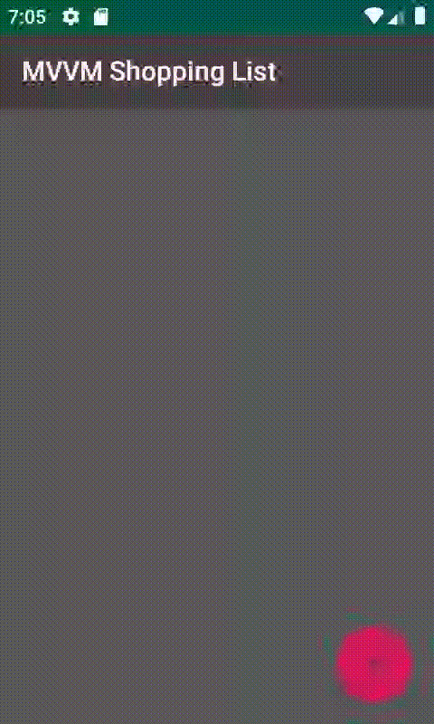

# Lista de Compras

Aplicación móvil para realizar una lista de compras básica

# Herramientas

Esta aplicación móvil con las siguientes librerías:

 - Lenguaje kotlin
 - Patron de Diseño MVVM
 - Lifecycle
 - Coroutines
 - Material Design(para el diseño de las pantallas y uso de la lista)
 - Kodein como inyector de dependencias

