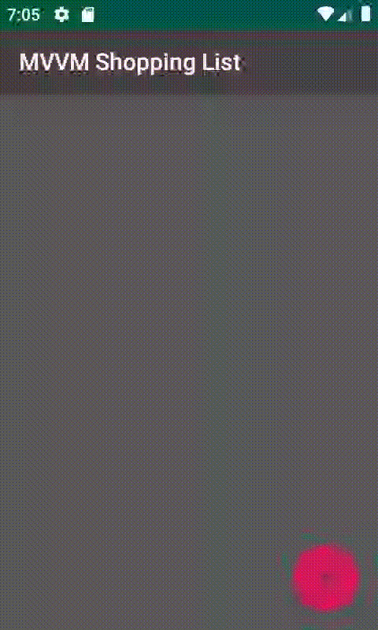

<h1 align="center">
  <br>
  <a href="http://www.ivancoder.com"></a>
</h1>

# Lista de Compras

Aplicación móvil para realizar una lista de compras básica

De la playlist [MVVM ShoppingList App KOTLIN](https://www.youtube.com/playlist?list=PLQkwcJG4YTCT0RouHZ6sQlE4JE6VyD2zO) en la plataforma de YouTube.

## Índice

- [Instalación](#instalación)
- [Uso](#uso)
- [Características](#características)
- [Vista Previa](#vista-previa)
- [Tecnologías Utilizadas](#tecnologías-utilizadas)
- [Redes Sociales o formas de contacto](#redes-sociales-o-formas-de-contacto)

```bash
# Clonar el repositorio
git clone https://github.com/ivxn31/MVVMShoppingList

# Navegar al directorio del proyecto
cd MVVMShoppingList
```

## Uso
Compilar el proyecto en Android Studio.

## Características

- Aplicación móvil para organizar listas de compras de forma sencilla.
- Permite agregar productos indicando su nombre y cantidad.
- Facilita aumentar o reducir la cantidad de cada producto.
- Permite eliminar artículos de la lista.
- Guarda la información para conservar la lista dentro de la aplicación.
- Cuenta con una interfaz clara, simple y fácil de utilizar.
- Incluye botones de acceso rápido para las acciones principales.
- Valida que la información necesaria esté completa antes de agregar un producto.
- Diseñada para ofrecer una experiencia práctica desde dispositivos Android.
- El proyecto demuestra conocimientos de desarrollo móvil, organización de código y diseño centrado en el usuario.
- Compatible desde Android API 21.
- Separación por capas: UI, ViewModel, repositorio, DAO y entidades.
- Pruebas unitarias e instrumentadas configuradas.

## Vista Previa



## Tecnologías Utilizadas
- Lenguaje kotlin
- Patron de Diseño MVVM
- Lifecycle
- ROOM
- Coroutines
- Material Design(para el diseño de las pantallas y uso de la lista)
- Kodein como inyector de dependencias

## Redes Sociales o formas de contacto
<p align="center">
  <a href="https://www.linkedin.com/in/ivan-tecp-martinez/" target="_blank">
    
  </a>
  <a href="https://www.ivancoder.com/" target="_blank">
    
  </a>
</p>